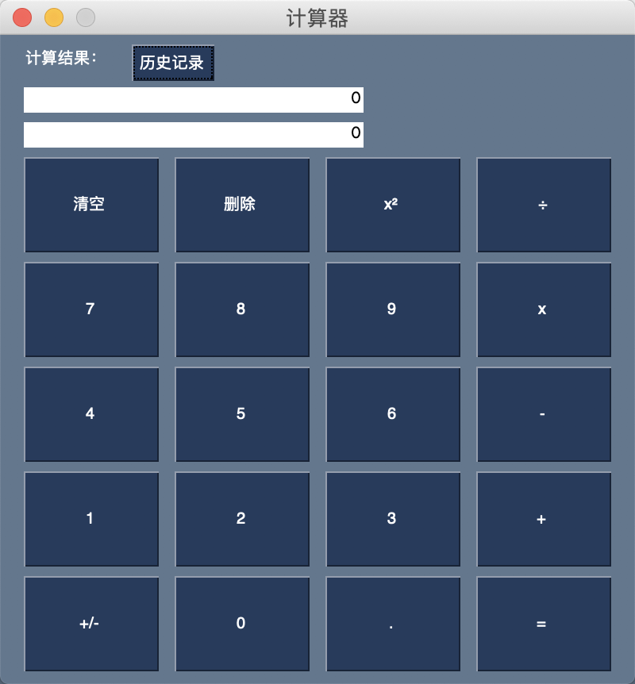
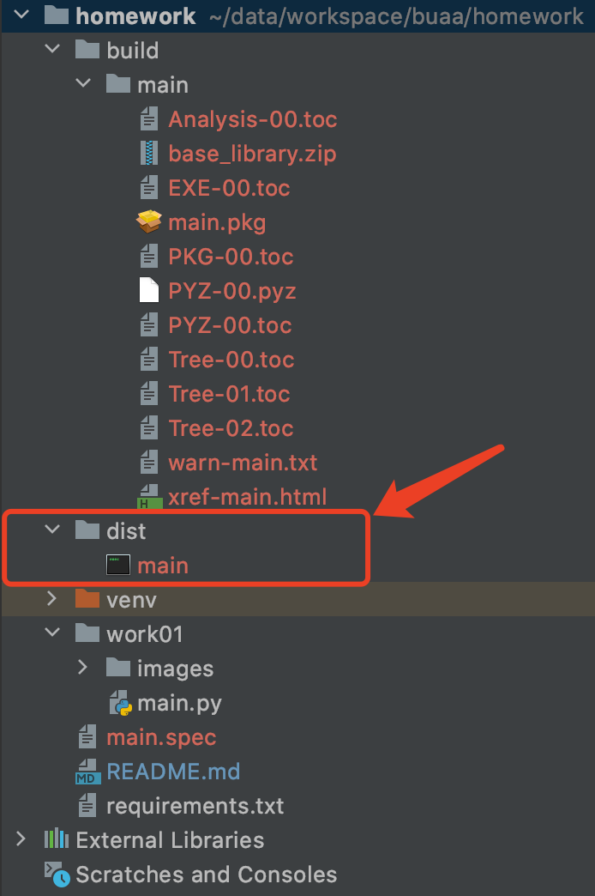
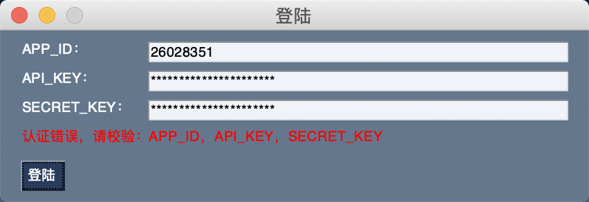
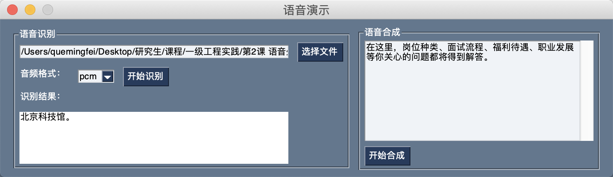
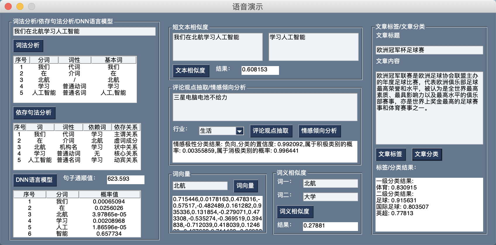
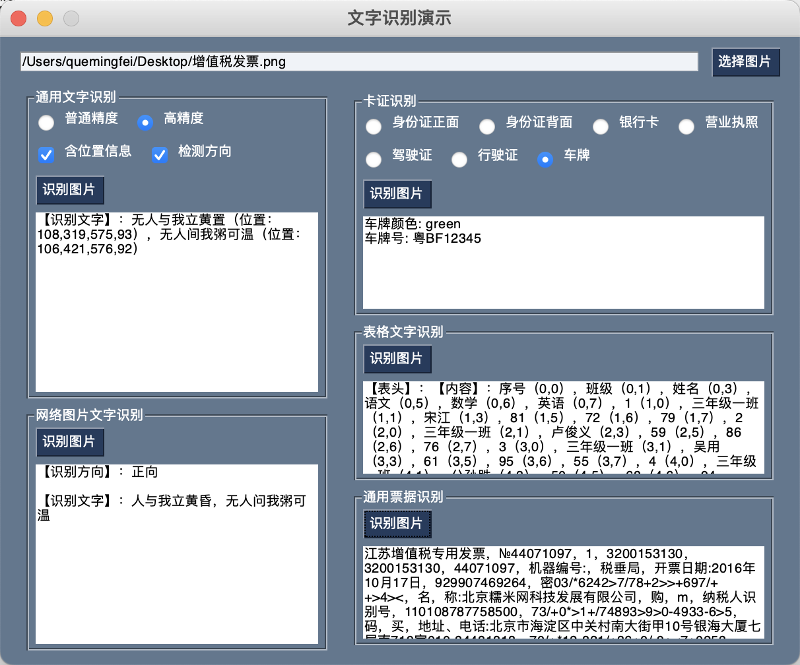
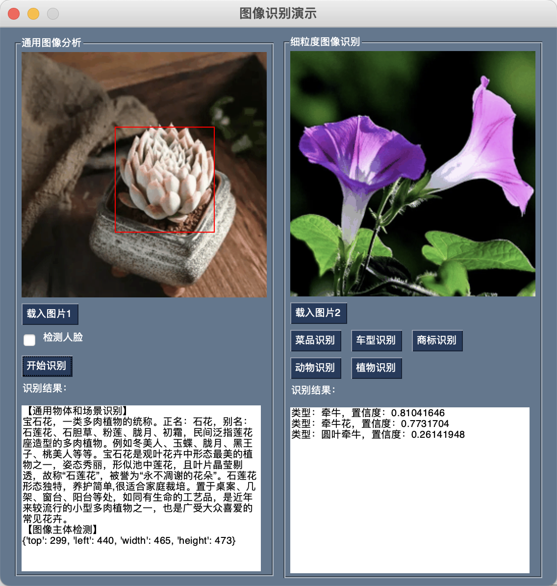

# buaa-primary-practice

北航一级工程实践作业

## 依赖包安装
```
pip install -r requirements.txt -i https://pypi.douban.com/simple
```

## 作业1：计算器

### 运行
```
python work01/main.py
```

### 效果


### 打包成exe

注意：需要在windows环境执行以下命令，在mac打包的产物无法在windows下（跨平台）运行
```
pyinstaller -F work01/main.py
```



## 作业2：语音识别与合成

### 运行
```
python work02/main.py
```

### 效果
1、先根据百度AI平台的APPID、KEY登陆


2、语音识别


3、语音合成

合成后的文件默认在当前目录下的"audio.mp3"

### 打包成exe
同作业1

## 作业3：自然语言处理演示

### 运行
```
python work03/main.py
```

### 效果
1、先根据百度AI平台的APPID、KEY登陆


2、自然语言处理演示


### 打包成exe
同作业1

## 作业4：人脸识别演示

### 运行
```
python work04/main.py
```

### 效果
人脸识别演示


### 打包成exe
同作业1

## 作业5：文字识别演示

### 运行
```
python work05/main.py
```

### 效果
人脸识别演示


### 打包成exe
同作业1


## 作业6：图片识别演示

### 运行
```
python work06/main.py
```

### 效果
人脸识别演示


### 打包成exe
同作业1

